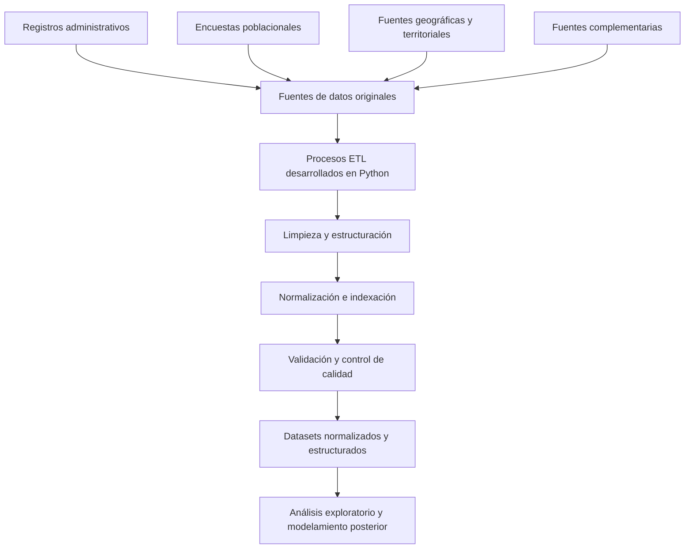
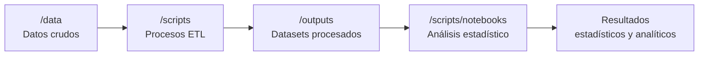
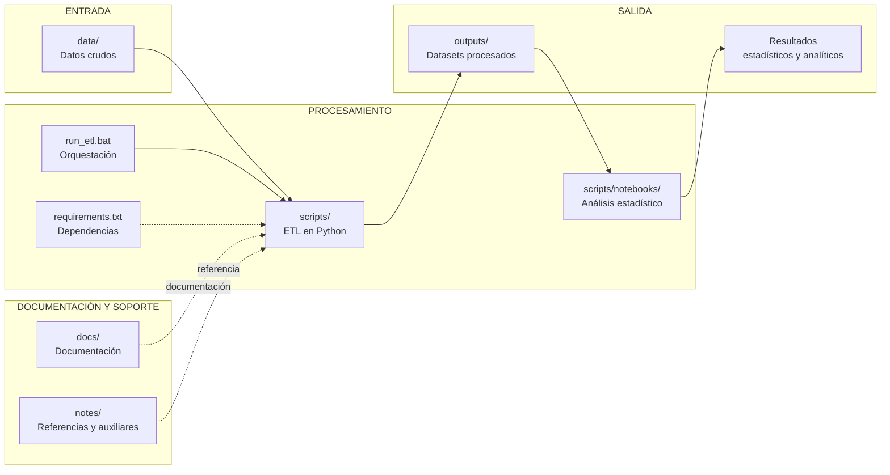

# DataJam Distrital Bogotá 2026

## Siseven Larpsito Sahur Devs

Proyecto de análisis de datos enfocado en la caracterización de factores asociados a la violencia contra las mujeres en Bogotá D.C., desarrollado en el marco de la **DataJam Distrital Bogotá 2026**.

### Equipo de trabajo

| Integrante                    | Rol                            |
| ----------------------------- | ------------------------------ |
| Ana Laura Morcote Chacón      | Analista de datos - Estudiante |
| Juan David Amaya Patiño       | Analista de datos - Estudiante |
| Tomás Alejandro Delgado Ortiz | Analista de datos - Estudiante |

---

# Descripción del problema abordado

La violencia contra las mujeres constituye una problemática pública multidimensional que requiere ser analizada considerando tanto los eventos registrados por las instituciones como aquellos factores sociales, territoriales y culturales que pueden influir en la visibilidad, denuncia y atención de estos fenómenos.

En Bogotá D.C., una parte importante de la información disponible proviene de registros administrativos generados por entidades distritales encargadas de la atención y seguimiento de casos de violencia. Sin embargo, estos registros representan únicamente aquellos eventos que ingresan al sistema institucional, por lo que pueden existir diferencias entre la violencia identificada por las entidades y la violencia realmente experimentada por la población.

El presente proyecto busca contribuir a la comprensión de esta problemática mediante la integración de diferentes fuentes de datos abiertos distritales, combinando registros administrativos, encuestas poblacionales e información territorial. Esta integración permite construir una base de datos estructurada que facilite posteriores análisis sobre violencia basada en género, acceso a rutas institucionales de atención, percepción ciudadana y condiciones sociales relacionadas.

La metodología del proyecto parte de la necesidad de complementar los datos institucionales con información proveniente de encuestas poblacionales, permitiendo incorporar dimensiones que no están presentes en los registros administrativos, como percepción de seguridad, barreras de acceso, confianza ciudadana, distribución del cuidado dentro del hogar y actitudes frente a la violencia.

El proyecto se desarrolla inicialmente mediante un proceso de extracción, transformación y carga (ETL), cuyo objetivo es consolidar información proveniente de múltiples fuentes heterogéneas en datasets organizados, consistentes y preparados para las etapas posteriores de análisis exploratorio, estadístico y geoespacial.

---

# Fuentes de datos utilizadas

El proyecto integra fuentes de datos abiertos provenientes principalmente de entidades distritales de Bogotá. Debido a que cada fuente tiene diferentes estructuras, objetivos de medición y niveles de agregación, fue necesario implementar procesos de limpieza, normalización y organización antes de realizar cualquier análisis posterior.

Las fuentes utilizadas corresponden a registros administrativos institucionales, encuestas poblacionales y datasets complementarios de contexto.

## Fuentes administrativas

| Fuente                                                                               | Entidad responsable              | Uso dentro del proyecto                                                                                                                         |
| ------------------------------------------------------------------------------------ | -------------------------------- | ----------------------------------------------------------------------------------------------------------------------------------------------- |
| Violencia intrafamiliar y de género en Bogotá D.C.                                   | Secretaría Distrital de Salud    | Fuente de información sobre eventos relacionados con violencia intrafamiliar y de género.                                                       |
| Cifras de mujeres valoradas en riesgo de feminicidio en Bogotá D.C., según localidad | Secretaría Distrital de la Mujer | Información territorial sobre mujeres valoradas en riesgo de feminicidio. Datos utilizados entre junio de 2025 y marzo de 2026.                 |
| Total de atenciones de Duplas en Bogotá D.C. por localidad                           | Secretaría Distrital de la Mujer | Registro de atenciones institucionales realizadas por las Duplas de Atención Psicosocial. Datos utilizados entre junio de 2025 y marzo de 2026. |
| Cifras de mujeres víctimas de delito sexual en Bogotá D.C. por localidad             | Secretaría Distrital de la Mujer | Información territorial relacionada con delitos sexuales. Datos utilizados entre junio de 2025 y marzo de 2026.                                 |
| Llamadas de urgencias y emergencias que ingresan a través de la línea 123            | Secretaría Distrital de Salud    | Registro de eventos reportados mediante la línea de emergencias distrital. Datos utilizados entre junio de 2025 y marzo de 2026.                |

## Fuentes poblacionales

| Fuente                               | Entidad responsable                                   | Uso dentro del proyecto                                                                                                                                      |
| ------------------------------------ | ----------------------------------------------------- | ------------------------------------------------------------------------------------------------------------------------------------------------------------ |
| Encuesta Distrital de Percepción     | Secretaría Distrital de Planeación                    | Fuente poblacional utilizada para incorporar variables de percepción ciudadana, condiciones sociales, barreras de acceso y factores relacionados con género. |
| Encuesta Bienal de Cultura Ciudadana | Secretaría de Cultura, Recreación y Deporte de Bogotá | Fuente utilizada para incorporar variables relacionadas con normas sociales, actitudes y percepciones culturales.                                            |

## Fuentes complementarias

| Fuente                                                    | Entidad responsable           | Uso dentro del proyecto                                                 |
| --------------------------------------------------------- | ----------------------------- | ----------------------------------------------------------------------- |
| Consumo abusivo o problemático de sustancias psicoactivas | Secretaría Distrital de Salud | Dataset complementario asociado a factores sociales y de contexto.      |
| Malnutrición en población de 18 a 64 años en Bogotá       | Secretaría Distrital de Salud | Dataset complementario asociado a condiciones sociales y poblacionales. |

---

# Metodología general

El proyecto implementa un proceso de **Extracción, Transformación y Carga (ETL)** orientado a preparar información proveniente de múltiples fuentes para su posterior análisis.

Debido a la diversidad de fuentes utilizadas, los datos presentan diferencias en estructura, nombres de variables, formatos, niveles de agregación y sistemas de identificación territorial. Por esta razón, se diseñó un pipeline de transformación cuyo objetivo principal es garantizar la calidad, trazabilidad y consistencia de los datasets generados.

El flujo general del procesamiento es:



## Proceso ETL

Los procesos de transformación y análisis se encuentran organizados dentro de la carpeta `/scripts`. Los scripts Python realizan las tareas correspondientes al proceso ETL, mientras que los notebooks ubicados en `scripts/notebooks/` consumen los datasets generados en /outputs y desarrollan la etapa de análisis estadístico.

La mayoría de los procesos implementan:

* Limpieza de registros inconsistentes.
* Organización y estructuración de tablas.
* Normalización de nombres y formatos de variables.
* Indexación y preparación de datos para consulta.
* Transformación de estructuras originales a formatos analizables.
* Validación de consistencia de los datos generados.
* Preparación de archivos finales para integración y análisis.

Para el tratamiento de información tabular se utiliza principalmente la librería **Pandas**, mientras que para información espacial se utiliza **GeoPandas**, permitiendo la generación y manejo de capas geográficas utilizadas posteriormente en análisis territoriales.

## Organización del pipeline de procesamiento y análisis

El proyecto se encuentra organizado como un flujo secuencial compuesto por dos etapas principales: una primera etapa de **Extracción, Transformación y Carga (ETL)** y una segunda etapa de **análisis estadístico**.

La primera etapa procesa las fuentes originales y genera los datasets normalizados almacenados en `/outputs`. Posteriormente, los notebooks de análisis utilizan estos productos como insumo para realizar los procedimientos estadísticos definidos en la metodología del proyecto.

El flujo general es:



Los procesos de la primera etapa mantienen una numeración que permite identificar su orden lógico de ejecución. La segunda etapa se encuentra organizada mediante notebooks especializados según el procedimiento analítico realizado.

## Procesos ETL

Los scripts Python ubicados en  `/scripts ` realizan las tareas de limpieza, transformación, normalización, estructuración y validación de las diferentes fuentes de datos.

Entre estos procesos se encuentran:

* 0_normalizacion_limpieza.py
* 1_create_geojson_localidades.py
* 2_normalizacion_secrmujer.py
* 2_normalizacion_vintrfamiliar.py
* 3_limpieza encuesta distrital de percepcion.ipynb
* 4_generacion_diccionario_preguntas_EcBienal.py
* 4_limpieza_dataset_ebcuesta_bienal.py
* 5_normalizacion_llamadas123.py

Los resultados de esta etapa son almacenados en `/outputs` y constituyen la entrada de los notebooks estadísticos.

## Análisis estadístico

Los notebooks de análisis se encuentran organizados en:

* scripts/
    * notebooks/
        * 01_preparacion.ipynb
        * 02_indices.ipynb
        * 03_modelos.ipynb
        * 04_agregacion_localidad.ipynb
        * 05_exportacion_tableau.ipynb

Estos notebooks utilizan los datasets generados por la etapa ETL para desarrollar progresivamente el procesamiento analítico:

- preparación de los datos para el análisis.
- construcción de los índices definidos en la metodología.
- ejecución de los modelos estadísticos.
- agregación de indicadores a nivel territorial.
- preparación de los resultados para su posterior visualización.

De esta manera, se mantiene una separación entre la preparación de los datos y el análisis estadístico, permitiendo que los resultados analíticos sean reproducibles a partir de los datasets normalizados generados por el ETL.

## Productos generados

Los archivos resultantes corresponden a datasets procesados y normalizados que serán utilizados como entrada para las fases posteriores del proyecto.

Entre los principales productos generados se encuentran:

* `base_violencia_mujer_limpia.csv`

  * Dataset consolidado relacionado con variables de violencia contra la mujer.

* `dataset_encuesta_percepcion_limpio.csv`

  * Dataset transformado correspondiente a la Encuesta Distrital de Percepción.

* `dataset_encuestaBienal_limpio.csv`

  * Dataset procesado correspondiente a la Encuesta Bienal de Cultura Ciudadana.

* `delitossexuales.csv`

  * Información normalizada relacionada con delitos sexuales.

* `riesgofeminicidio.csv`

  * Dataset procesado sobre mujeres valoradas en riesgo de feminicidio.

* `lineapurpura.csv`

  * Información estructurada sobre atenciones institucionales de la Línea Púrpura.

* `duplas.csv`

  * Información procesada de atención mediante Duplas.

* `llamadas123_consolidado_limpio.csv`

  * Dataset normalizado proveniente de llamadas recibidas por la línea 123.

* `localidades_con_nombres.geojson`

  * Información geográfica utilizada para integración territorial.

* `diccionario_preguntas_variables.csv`

  * Diccionario auxiliar para interpretar variables provenientes de encuestas.

* `v01_verificacion_bloque404.csv`

  * Archivo de validación generado durante el proceso de revisión y control de calidad.

---

# Instrucciones de ejecución

El proyecto cuenta con un pipeline automatizado cuyo punto de entrada es el archivo:

```
run_etl.bat
```

Este archivo permite ejecutar el proceso completo de transformación sin necesidad de ejecutar manualmente cada script individual.

El flujo de ejecución realiza las siguientes acciones:

1. Ubicación automática en la raíz del proyecto.
2. Creación del entorno virtual de Python si no existe.
3. Instalación de dependencias desde `requirements.txt`.
4. Activación del entorno virtual.
5. Ejecución del pipeline ETL.

Para ejecutar el proyecto:

```bash
run_etl.bat
```

Durante la ejecución se muestra en consola:

* scripts encontrados;
* notebooks encontrados;
* proceso actualmente ejecutado;
* mensajes generados por cada etapa;
* errores encontrados durante la ejecución;
* estado final del pipeline.

El archivo `run_etl.bat` ejecuta inicialmente:

```
scripts/0_normalizacion_limpieza.py
```

Este archivo funciona como orquestador principal y se encarga de ejecutar secuencialmente los demás scripts y notebooks ubicados dentro de `/scripts`.

El orquestador:

* identifica automáticamente archivos `.py` y `.ipynb`;
* ejecuta los scripts utilizando el intérprete activo del entorno virtual;
* ejecuta notebooks mediante `jupyter nbconvert`;
* captura mensajes de salida y errores;
* permite continuar o detener la ejecución dependiendo del resultado obtenido.

---

# Estructura del repositorio

El repositorio está organizado separando datos fuente, procesos de transformación, documentación y productos finales:




La estructura busca mantener una separación clara entre datos originales, código de transformación y productos derivados, facilitando la trazabilidad del proceso y permitiendo reproducir la preparación de los datos antes de las etapas de análisis.
